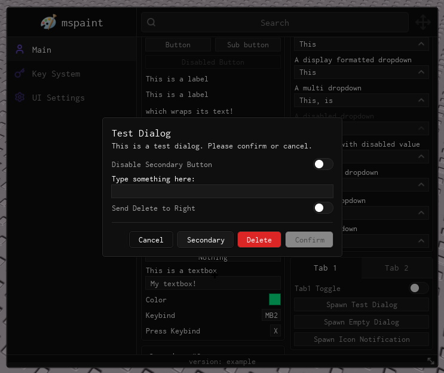
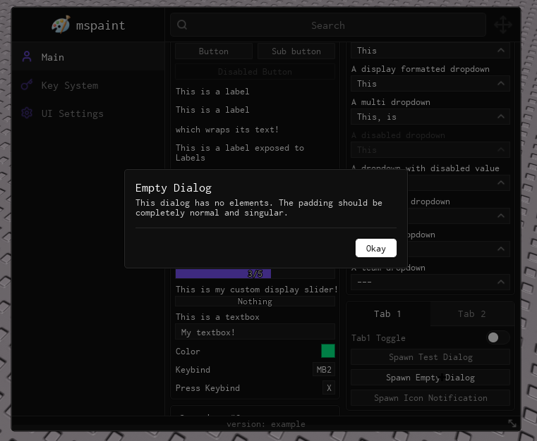

import { InlineTOC } from 'fumadocs-ui/components/inline-toc';
import { Tab, Tabs } from "fumadocs-ui/components/tabs";
import { TypeTable } from '@/components/type-table';
import { Callout } from "fumadocs-ui/components/callout";

<InlineTOC items={toc} />

---

## Dialogs

Dialogs overlay the user interface and blur out the background, demanding the user's attention.

Dialogs inherit methods from Groupboxes therefore you can call all standard Groupbox methods (`AddToggle`, `AddInput`, `AddSlider`, etc.) on the returned Dialog instance to build custom interactions directly into the Dialog.

<Tabs items={['test.lua', 'empty.lua']}>
  <Tab value="test.lua">

  

  ```lua
  local Dialog
  Dialog = Window:AddDialog("DialogueIdx", {
      Title = "Test Dialog",
      Description = "This is a test dialog. Please confirm or cancel.",
      AutoDismiss = true,
      OutsideClickDismiss = true,
      FooterButtons = {
          Cancel = {
              Title = "Cancel",
              Variant = "Ghost",
              Order = 1,
              Callback = function()
                  print("Cancelled the dialog.")
              end
          },
          Secondary = {
              Title = "Secondary",
              Variant = "Secondary",
              Order = 2,
              Callback = function()
                  print("Secondary action.")
              end
          },
          Delete = {
              Title = "Delete",
              Variant = "Destructive",
              Order = 3,
              Callback = function()
                  print("Deleted the asset.")
              end
          },
          Confirm = {
              Title = "Confirm",
              Variant = "Primary",
              WaitTime = 3, -- 3 seconds minimum wait
              Order = 4,
              Callback = function(self)
                  print("Confirmed the dialog.")
              end
          }
      }
  })

  Dialog:AddToggle("DisableSecondary", {
      Text = "Disable Secondary Button",
      Default = false,
      Callback = function(value) 
          Dialog:SetButtonDisabled("Secondary", value) 
      end
  })

  Dialog:AddInput("InputTest", {
      Text = "Type something here:",
      Callback = function(value) print("Typed:", value) end
  })

  Dialog:AddToggle("SwapDeleteOrder", {
      Text = "Send Delete to Right",
      Default = false,
      Callback = function(value) 
          Dialog:SetButtonOrder("Delete", value and 5 or 3)
      end
  })
  ```

  </Tab>
  <Tab value="empty.lua">

  

  ```lua
  Window:AddDialog("EmptyDialogueIdx", {
      Title = "Empty Dialog",
      Description = "This dialog has no elements. The padding should be completely normal and singular.",
      AutoDismiss = true,
      OutsideClickDismiss = true,
      FooterButtons = {
          Confirm = {
              Title = "Okay",
              Variant = "Primary",
              Callback = function() end
          }
      }
  })
  ```

  </Tab>
</Tabs>

<TypeTable type={{
  Title: {
    description: 'The title of the dialog',
    type: 'string',
    default: '"No Title"',
    required: false
  },
  Description: {
    description: 'The description of the dialog',
    type: 'string',
    default: '"No Description"',
    required: false
  },
  AutoDismiss: {
    description: 'Whether the dialog automatically closes when a footer button is pressed',
    type: 'boolean',
    default: 'true',
    required: false
  },
  OutsideClickDismiss: {
    description: 'Whether clicking the darkened background automatically closes the dialog',
    type: 'boolean',
    default: 'false',
    required: false
  },
  FooterButtons: {
    description: 'A configuration table governing all bottom-aligned buttons',
    type: 'string mapped to DialogButtonInfo',
    default: '{}',
    required: false
  },
  Icon: {
    description: 'The icon of the dialog',
    type: 'string',
    default: 'nil',
    required: false
  },
  TitleColor: {
    description: 'The color of the dialog title',
    type: 'Color3',
    default: 'FontColor (Inherited from theme)',
    required: false
  },
  DescriptionColor: {
    description: 'The color of the dialog description',
    type: 'Color3',
    default: 'FontColor (Inherited from theme +20% transparency if color is not set)',
    required: false
  },
}}/>

### Custom Button Example
To configure custom footer buttons, specify a dictionary mapped to their properties in `FooterButtons`. You can natively assign a `WaitTime` to any button, and Obsidian will render an animated progress bar preventing interaction until the timer expires.

```lua
Confirm = {
    Title = "Confirm",
    Variant = "Primary", -- Optional (Primary, Secondary, Destructive, Ghost)
    WaitTime = 3, -- 3 seconds minimum before the button can be clicked
    Order = 4,
    Callback = function(self)
        print("Confirmed the dialog.")
    end
}
```

### Methods
<Callout type="info">
  Dialogs inherit all methods from Groupboxes. You may use `AddToggle`, `AddInput`, `AddDropdown`, and so forth directly on the Dialog instance itself. The methods below are unique to Dialogs.
</Callout>

#### SetTitle
Update the dialog title dynamically.

```lua
Dialog:SetTitle("New Title")
```

| Arg Idx | Argument Description | Type | Default |
| --- | --- | --- | --- |
| 1 | New title of the dialog | string | nil |

#### SetDescription
Refresh the descriptive text dynamically.

```lua
Dialog:SetDescription("New Description")
```

| Arg Idx | Argument Description | Type | Default |
| --- | --- | --- | --- |
| 1 | New description of the dialog | string | nil |

#### AddFooterButton
Programmatically inject a new footer button into the dialog.

```lua
Dialog:AddFooterButton("ExtraAction", {
    Title = "Do something else",
    Variant = "Secondary",
    Callback = function() end
})
```

| Arg Idx | Argument Description | Type | Default |
| --- | --- | --- | --- |
| 1 | Dictionary Index Reference | string | nil |
| 2 | Dialog Button Configuration Table | DialogButtonInfo | nil |

#### RemoveFooterButton
Programmatically remove an existing footer button from the dialog.

```lua
Dialog:RemoveFooterButton("ExtraAction")
```

| Arg Idx | Argument Description | Type | Default |
| --- | --- | --- | --- |
| 1 | Dictionary Index Reference | string | nil |

#### SetButtonDisabled
Change the disabled state of a specific footer button dynamically.

```lua
Dialog:SetButtonDisabled("Confirm", true)
```

| Arg Idx | Argument Description | Type | Default |
| --- | --- | --- | --- |
| 1 | Dictionary Index Reference | string | nil |
| 2 | Whether the button should be disabled | boolean | nil |

#### SetButtonOrder
Change the display order index of a specific footer button dynamically.

```lua
Dialog:SetButtonOrder("Delete", 5)
```

| Arg Idx | Argument Description | Type | Default |
| --- | --- | --- | --- |
| 1 | Dictionary Index Reference | string | nil |
| 2 | New Layout Order | number | nil |

#### Dismiss
Explicitly close and destroy the dialog and all its visual child elements.

```lua
Dialog:Dismiss()
```
