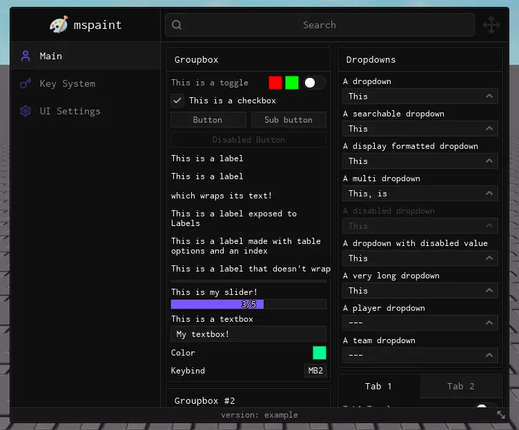
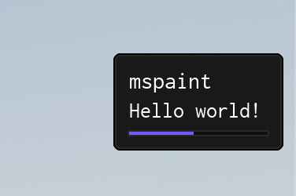
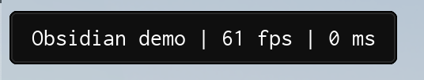
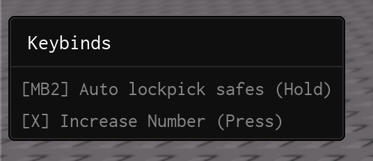
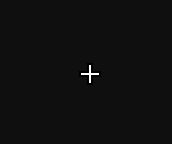

import { InlineTOC } from 'fumadocs-ui/components/inline-toc';
import { Tab, Tabs } from "fumadocs-ui/components/tabs";
import { TypeTable } from '@/components/type-table';

<InlineTOC items={toc} />

---

## Window



The `Window` object is your base UI container. It hosts tabs, groupboxes and mostly everything else driven by the library. The next step to using the library is to [create a tab inside the window](../structure/tabs).

### Usage
Create a window with `Library:CreateWindow()` and override any defaults you need:

```lua
local Window = Library:CreateWindow({
    Title = "mspaint",
    Footer = "version: example",
    Icon = 95816097006870,
    NotifySide = "Right",
})
```

<TypeTable
  type={{
    Title: {
      description: 'The title displayed at the top of the window',
      type: 'string',
      default: '"No Title"',
      required: true
    },
    Footer: {
      description: 'The text displayed at the bottom of the window',
      type: 'string',
      default: '"No Footer"',
      required: true
    },
    Position: {
      description: 'The initial position of the window',
      type: 'UDim2',
      default: 'UDim2.fromOffset(6, 6)',
      required: false
    },
    Size: {
      description: 'The size of the window',
      type: 'UDim2',
      default: 'UDim2.fromOffset(720, 600)',
      required: false
    },
    Center: {
      description: 'Whether to center the window on the screen',
      type: 'boolean',
      default: 'true',
      required: false
    },
    AutoShow: {
      description: 'Whether to show the window immediately',
      type: 'boolean',
      default: 'true',
      required: false
    },
    ToggleKeybind: {
      description: 'The keybind to toggle the UI',
      type: 'Enum.KeyCode',
      default: 'Enum.KeyCode.RightControl',
      required: false
    },
    NotifySide: {
      description: 'The side to show notifications ("Left" or "Right")',
      type: 'string',
      default: '"Right"',
      required: false
    },
    ShowCustomCursor: {
      description: 'Whether to show a custom cursor',
      type: 'boolean',
      default: 'true',
      required: false
    },
    Font: {
      description: 'The font to use for text',
      type: 'Enum.Font',
      default: 'Enum.Font.Code',
      required: false
    },
    CornerRadius: {
      description: 'The corner radius for UI elements',
      type: 'number',
      default: '4',
      required: false
    },
    Icon: {
      description: 'Optional icon for the window',
      type: 'string/ID',
      default: 'nil',
      required: false
    },
    IconSize: {
      description: 'Size of the icon if provided',
      type: 'UDim2',
      default: 'UDim2.fromOffset(30, 30)',
      required: false
    },
    BackgroundImage: {
      description: 'Background image for the window',
      type: 'string/ID',
      default: 'nil',
      required: false
    },
    Resizable: {
      description: 'Whether the window can be resized',
      type: 'boolean',
      default: 'true',
      required: false
    },
    MobileButtonsSide: {
      description: 'Side to place mobile buttons on Load (Toggle/Lock buttons)',
      type: '"Left" | "Right"',
      default: '"Left"',
      required: false
    },
    DisableSearch: {
      description: 'Whether to disable the search box',
      type: 'boolean',
      default: 'false',
      required: false
    },
    SearchbarSize: {
      description: 'Size of the searchbar',
      type: 'UDim2',
      default: 'UDim2.fromScale(1, 1)',
      required: false
    },
    UnlockMouseWhileOpen: {
      description: 'Whether to allow mouse movement while the Window is open even when the cursor\'s position is locked to the center (for example when in first person)',
      type: 'boolean',
      default: 'true',
      required: false
    }
  }}
/>

---

## Notifications



Use `Library:Notify()` for quick, non-blocking feedback. Notifications support:

- Simple timed popups.
- Persistent messages you can update or destroy.
- Progress indicators with step counters.
- Optional sounds or other custom behavior based on your own logic.

### Creating a notification

Choose between positional arguments for quick calls or a configuration table for full control.

#### Regular parameters
```lua
Library:Notify("Hello world!", 4)
```

| Arg Idx | Argument Description | Type | Default |
| --- | --- | --- | --- |
| 1 | Description of the notification | string | "nil" |
| 2 | Amount of time to show the notification for | number \| instance | 4 |
| 3 | SoundId to play when the notification is shown | number | nil |


#### Table parameters
Pick an example that matches your use case:
<Tabs items={['simple.lua', 'persistent.lua', 'update.lua', 'progress.lua']}>
  <Tab value="simple.lua">
    ```lua
    Library:Notify({
        Title = "mspaint",
        Description = "Hello world!",
        Time = 4,
    })
    ```
  </Tab>

  <Tab value="persistent.lua">
    ```lua
    local Notification = Library:Notify({
        Title = "mspaint",
        Description = "Waiting for next match...",
        Persist = true,
    })

    -- Wait for the player to start playing
    game.Players.LocalPlayer:GetAttributeChangedSignal("Playing"):Wait()

    -- Destroy the notification
    Notification:Destroy()
    ```
  </Tab>

  <Tab value="update.lua">
    ```lua
    -- Create a persistent notification (this also works for non persistent notifications)
    local Notification = Library:Notify({
        Title = "mspaint",
        Description = "Waiting for next match...",
        Persist = true,
    })

    -- Wait for the player to start playing
    game.Players.LocalPlayer:GetAttributeChangedSignal("Playing"):Wait()

    -- Update the notification
    Notification:ChangeTitle("mspaint - Match Starting")
    Notification:ChangeDescription("Waiting for match to finish loading...")

    -- Wait for the match to finish loading
    workspace.Map:GetAttributeChangedSignal("MatchLoaded"):Wait()

    -- Remove the notification
    Notification:Destroy()
    ```
    </Tab>

    <Tab value="progress.lua">
    ```lua
    -- Create a progress notification (steps = amount of steps)
    local Notification = Library:Notify({
        Title = "mspaint",
        Description = "Loading...",
        Steps = 10,
    })

    for i = 1, 10 do
        -- Update the notification with the current step
        Notification:ChangeStep(i)
        task.wait(0.1)
    end

    Notification:Destroy()
    ```
    </Tab>
</Tabs>

<TypeTable type={{
  Title: {
    description: 'The title of the notification',
    type: 'string',
    default: '"No Title"',
    required: false
  },
  Description: {
    description: 'The description of the notification',
    type: 'string',
    default: '"No Description"',
    required: true
  },
  Time: {
    description: 'The duration of the notification in seconds',
    type: 'number',
    default: 5,
    required: false
  },
  Steps: {
    description: 'The total number of steps',
    type: 'number',
    default: '0',
    required: false
  },
  Persist: {
    description: 'Whether to persist the notification',
    type: 'boolean',
    default: 'false',
    required: false
  },
  SoundId: {
    description: 'The sound ID to play when the notification is shown',
    type: 'number',
    default: 'nil',
    required: false
  },
}}/>

### Methods

#### ChangeTitle
Update the notification title without recreating it.

```lua
Notification:ChangeTitle("New Title")
```

| Arg Idx | Argument Description | Type | Default |
| --- | --- | --- | --- |
| 1 | New title of the notification | string | nil |

#### ChangeDescription
Refresh the supporting text while keeping the notification open.

```lua
Notification:ChangeDescription("New Description")
```

| Arg Idx | Argument Description | Type | Default |
| --- | --- | --- | --- |
| 1 | New description of the notification | string | nil |

#### ChangeStep
Advance or rewind the progress bar when using step-based notifications.

```lua
Notification:ChangeStep(5)
```

| Arg Idx | Argument Description | Type | Default |
| --- | --- | --- | --- |
| 1 | New step of the progress notification | number | nil |

#### Destroy
Immediately dismiss the notification and free its resources.

```lua
Notification:Destroy()
```

---

## Watermark



The watermark is a compact, draggable overlay that typically lives in the top-left corner. It is ideal for surfacing live stats such as FPS, ping, server identifiers or script versions. The feature is inspired by the [LinoriaLib UI Library](https://github.com/mstudio45/linorialib).

### Methods

#### SetVisibility
Sets the watermark visibility.

```lua
Library:SetWatermarkVisibility(true)
```

| Arg Idx | Argument Description | Type | Default |
| --- | --- | --- | --- |
| 1 | Whether to show the watermark | boolean | true |

#### SetWatermark
Sets the watermark text.

```lua
Library:SetWatermark("Obsidian demo")
```

| Arg Idx | Argument Description | Type | Default |
| --- | --- | --- | --- |
| 1 | Text to display in the watermark | string | nil |


### Example

```lua
-- Sets the watermark visibility
Library:SetWatermarkVisibility(true)

-- Example of dynamically-updating watermark with common traits (fps and ping)
local FrameTimer = tick()
local FrameCounter = 0;
local FPS = 60;

local WatermarkConnection = game:GetService('RunService').RenderStepped:Connect(function()
    FrameCounter += 1;

    if (tick() - FrameTimer) >= 1 then
        FPS = FrameCounter;
        FrameTimer = tick();
        FrameCounter = 0;
    end;

    Library:SetWatermark(('Obsidian demo | %s fps | %s ms'):format(
        math.floor(FPS),
        math.floor(game:GetService('Stats').Network.ServerStatsItem['Data Ping']:GetValue())
    ));
end);
```

---

## Keybinds Menu



The keybinds menu surfaces every registered keybind alongside its current state. When a keybind is configured in `Toggle` mode the menu also renders tap-friendly buttons, giving mobile players parity with keyboard users.

```lua
Library.ShowToggleFrameInKeybinds = true -- Show toggle state in keybind menu
```

---

## Custom Cursor



Enable the custom cursor to render the Obsidian-styled pointer at your mouse position—handy for experiences that hide or replace Roblox's default cursor.

```lua
Library.ShowCustomCursor = true
```
---

## Icons

Icons originate from the [lucide icon pack](https://lucide.dev). You can change the icon library so long as you call it before creating any UI elements and it follows the expected return data.

```lua
local Library = require(game:GetService("ReplicatedStorage"):WaitForChild("Obsidian"))
local Icons = require(game:GetService("ReplicatedStorage"):WaitForChild("Lucide"))

-- Set Library Icon Module
Library:SetIconModule(Icons)
```

The direct lucide module can be found [here](https://raw.githubusercontent.com/deividcomsono/lucide-roblox-direct/refs/heads/main/source.lua). (Our automation updates the icon spritesheet each month)

### Custom Icon Registry

If you'd like to make your own custom Icon Module, make sure it follows these types:

```lua
type Icon = {
    Url: string,
    Id: number,
    IconName: string,
    ImageRectOffset: Vector2,
    ImageRectSize: Vector2,
}

type IconModule = {
    Icons: { string },
    GetAsset: (Name: string) -> Icon?,
}

local Icons: IconModule = {
    Icons: {}
}

function Icons.GetAsset(Name: string)
    return nil
end

return Icons
```

Obsidian is dependent on a few icons to be able to be displayed properly.
Please make sure you have icons named: `check` (Toggles), `chevron-up` (Dropdowns), `move-diagonal-2` (Window Resizing Icon bottom right of the window), `key` (Key System Tab Icon), `search` (Searchbar), `move` (Window movement Icon top right of the window)