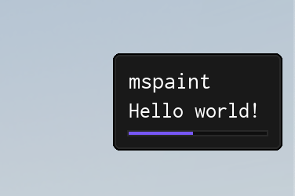

import { InlineTOC } from 'fumadocs-ui/components/inline-toc';
import { Tab, Tabs } from "fumadocs-ui/components/tabs";
import { TypeTable } from '@/components/type-table';

<InlineTOC items={toc} />

---

## Notifications



Use `Library:Notify()` for quick, non-blocking feedback. Notifications support:

- Simple timed popups.
- Persistent messages you can update or destroy.
- Progress indicators with step counters.
- Optional sounds or other custom behavior based on your own logic.

### Creating a notification

Choose between positional arguments for quick calls or a configuration table for full control.

#### Regular parameters
```lua
Library:Notify("Hello world!", 4)
```

| Arg Idx | Argument Description | Type | Default |
| --- | --- | --- | --- |
| 1 | Description of the notification | string | "nil" |
| 2 | Amount of time to show the notification for | number \| instance | 4 |
| 3 | SoundId to play when the notification is shown | number | nil |


#### Table parameters
Pick an example that matches your use case:
<Tabs items={['simple.lua', 'icon.lua', 'image.lua', 'persistent.lua', 'update.lua', 'progress.lua']}>
  <Tab value="simple.lua">
    ```lua
    Library:Notify({
        Title = "mspaint",
        Description = "Hello world!",
        Time = 4,
    })
    ```
  </Tab>

  <Tab value="icon.lua">
    ```lua
    Library:Notify({
        Title = "Icon Notification",
        Description = "This notification has a neat little icon beside the text.",
        Icon = "info", -- Lucide icon Name
        Time = 4,
    })
    ```
  </Tab>

  <Tab value="image.lua">
    ```lua
    Library:Notify({
        Title = "Big Icon Notification",
        Description = "This notification is using the legacy 24x24 separated image layout.",
        BigIcon = "rbxassetid://10204738596",
        IconColor = Color3.new(0, 1, 0), -- Green
        Time = 4,
    })
    ```
  </Tab>

  <Tab value="persistent.lua">
    ```lua
    local Notification = Library:Notify({
        Title = "mspaint",
        Description = "Waiting for next match...",
        Persist = true,
    })

    -- Wait for the player to start playing
    game.Players.LocalPlayer:GetAttributeChangedSignal("Playing"):Wait()

    -- Destroy the notification
    Notification:Destroy()
    ```
  </Tab>

  <Tab value="update.lua">
    ```lua
    -- Create a persistent notification (this also works for non persistent notifications)
    local Notification = Library:Notify({
        Title = "mspaint",
        Description = "Waiting for next match...",
        Persist = true,
    })

    -- Wait for the player to start playing
    game.Players.LocalPlayer:GetAttributeChangedSignal("Playing"):Wait()

    -- Update the notification
    Notification:ChangeTitle("mspaint - Match Starting")
    Notification:ChangeDescription("Waiting for match to finish loading...")

    -- Wait for the match to finish loading
    workspace.Map:GetAttributeChangedSignal("MatchLoaded"):Wait()

    -- Remove the notification
    Notification:Destroy()
    ```
    </Tab>

    <Tab value="progress.lua">
    ```lua
    -- Create a progress notification (steps = amount of steps)
    local Notification = Library:Notify({
        Title = "mspaint",
        Description = "Loading...",
        Steps = 10,
    })

    for i = 1, 10 do
        -- Update the notification with the current step
        Notification:ChangeStep(i)
        task.wait(0.1)
    end

    Notification:Destroy()
    ```
    </Tab>
</Tabs>

<TypeTable type={{
  Title: {
    description: 'The title of the notification',
    type: 'string',
    default: '"No Title"',
    required: false
  },
  Description: {
    description: 'The description of the notification',
    type: 'string',
    default: '"No Description"',
    required: true
  },
  Time: {
    description: 'The duration of the notification in seconds',
    type: 'number',
    default: 5,
    required: false
  },
  Steps: {
    description: 'The total number of steps',
    type: 'number',
    default: '0',
    required: false
  },
  Persist: {
    description: 'Whether to persist the notification',
    type: 'boolean',
    default: 'false',
    required: false
  },
  SoundId: {
    description: 'The sound ID to play when the notification is shown',
    type: 'number',
    default: 'nil',
    required: false
  },
  Icon: {
    description: 'The Lucide icon or Image to display inline in the notification',
    type: 'string',
    default: 'nil',
    required: false
  },
  BigIcon: {
    description: 'The legacy 24x24 separated image layout to display (e.g. "rbxassetid://123456")',
    type: 'string',
    default: 'nil',
    required: false
  },
  IconColor: {
    description: 'The Color3 to apply to the legacy image layout',
    type: 'Color3 | string',
    default: 'nil',
    required: false
  },
}}/>

### Methods

#### ChangeTitle
Update the notification title without recreating it.

```lua
Notification:ChangeTitle("New Title")
```

| Arg Idx | Argument Description | Type | Default |
| --- | --- | --- | --- |
| 1 | New title of the notification | string | nil |

#### ChangeDescription
Refresh the supporting text while keeping the notification open.

```lua
Notification:ChangeDescription("New Description")
```

| Arg Idx | Argument Description | Type | Default |
| --- | --- | --- | --- |
| 1 | New description of the notification | string | nil |

#### ChangeStep
Advance or rewind the progress bar when using step-based notifications.

```lua
Notification:ChangeStep(5)
```

| Arg Idx | Argument Description | Type | Default |
| --- | --- | --- | --- |
| 1 | New step of the progress notification | number | nil |

#### Destroy
Immediately dismiss the notification and free its resources.

```lua
Notification:Destroy()
```
