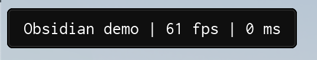
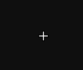
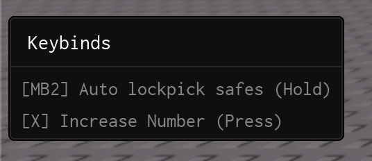

import { InlineTOC } from 'fumadocs-ui/components/inline-toc';
import { Callout } from "fumadocs-ui/components/callout";
import { Accordion, Accordions } from 'fumadocs-ui/components/accordion';

<InlineTOC items={toc} />

---

## Draggable Labels



Draggable Labels are compact, draggable overlays containing text. They are ideal for surfacing information such as FPS, ping, server info, etc. The feature is inspired by the [LinoriaLib UI Library Watermark feature](https://github.com/mstudio45/linorialib).

### Methods

#### AddDraggableLabel

Adds a draggable label to the UI.

```lua
Library:AddDraggableLabel("Obsidian demo")
```

| Arg Idx | Argument Description | Type | Default |
| --- | --- | --- | --- |
| 1 | Text to display in the draggable label | string | nil |

#### SetText

Sets the draggable label text.

```lua
local DraggableLabel = Library:AddDraggableLabel("Obsidian demo")
DraggableLabel:SetText("Obsidian demo v2")
```

| Arg Idx | Argument Description | Type | Default |
| --- | --- | --- | --- |
| 1 | Text to display in the draggable label | string | nil |

#### SetVisible

Sets the draggable label visibility.

```lua
local DraggableLabel = Library:AddDraggableLabel("Obsidian demo")
DraggableLabel:SetVisible(false)
```

| Arg Idx | Argument Description | Type | Default |
| --- | --- | --- | --- |
| 1 | Whether to show the draggable label | boolean | true |

### Example

```lua
-- Sets the draggable label visibility
local DraggableLabel = Library:AddDraggableLabel("Obsidian demo")
DraggableLabel:SetVisible(true)

-- Example of dynamically-updating draggable label with common traits (fps and ping)
local FrameTimer = tick()
local FrameCounter = 0;
local FPS = 60;

local WatermarkConnection = game:GetService('RunService').RenderStepped:Connect(function()
    FrameCounter += 1;

    if (tick() - FrameTimer) >= 1 then
        FPS = FrameCounter;
        FrameTimer = tick();
        FrameCounter = 0;
    end;

    DraggableLabel:SetText(('Obsidian demo | %s fps | %s ms'):format(
        math.floor(FPS),
        math.floor(game:GetService('Stats').Network.ServerStatsItem['Data Ping']:GetValue())
    ));
end);
```

---

## Custom Cursor



Enable the custom cursor to render the Obsidian-styled pointer at your mouse position—handy for experiences that hide or replace Roblox's default cursor.

```lua
Library.ShowCustomCursor = true
```

These functions allow you to set your own image instead of the default custom cursor.

```lua
Library:ChangeCursorIcon(ImageId: string)

-- If you need to change the cursor icon size:
Library:ChangeCursorIconSize(Size: UDim2)

-- To reset it back, use this function:
Library:ResetCursorIcon()
```

---

## Icons

Icons originate from the [lucide icon pack](https://lucide.dev). You can change the icon library so long as you call it before creating any UI elements and it follows the expected return data.

```lua
local Library = require(game:GetService("ReplicatedStorage"):WaitForChild("Obsidian"))
local Icons = require(game:GetService("ReplicatedStorage"):WaitForChild("Lucide"))

-- Set Library Icon Module
Library:SetIconModule(Icons)
```

The direct lucide module can be found [here](https://raw.githubusercontent.com/deividcomsono/lucide-roblox-direct/refs/heads/main/source.lua). (Our automation updates the icon spritesheet each month)

### Custom Icon Registry

If you'd like to make your own custom Icon Module, make sure it follows these types:

```lua
type Icon = {
    Url: string,
    Id: number,
    IconName: string,
    ImageRectOffset: Vector2,
    ImageRectSize: Vector2,
}

type IconModule = {
    Icons: { string },
    GetAsset: (Name: string) -> Icon?,
}

local Icons: IconModule = {
    Icons: {}
}

function Icons.GetAsset(Name: string)
    return nil
end

return Icons
```

Obsidian is dependent on a few icons to be able to be displayed properly.
Please make sure you have icons named: `check` (Toggles), `chevron-up` (Dropdowns), `move-diagonal-2` (Window Resizing Icon bottom right of the window), `key` (Key System Tab Icon), `search` (Searchbar), `move` (Window movement Icon top right of the window)

---

### Custom Asset Icons

If you'd like to use custom hosted images (like those on Github) with a Roblox Asset ID as a fallback, you can use the built-in ImageManager:

```lua
local ImageManager = Library.ImageManager
```

#### AddAsset

Adds a custom asset to the ImageManager

```lua
ImageManager.AddAsset("mspaint_logo", 95816097006870, "https://www.mspaint.cc/icon.png")
```

| Arg Idx | Argument Description | Type | Default |
| --- | --- | --- | --- |
| 1 | Asset Name | string | nil |
| 2 | Roblox Asset ID | number | nil |
| 3 | Asset URL | string | nil |
| 4 | Force Redownload | boolean? | nil |

#### GetAsset

Retrieves the asset ID for the provided asset

```lua
local AssetID = ImageManager.GetAsset("mspaint_logo")
```

| Arg Idx | Argument Description | Type | Default |
| --- | --- | --- | --- |
| 1 | Asset Name | string | nil |

#### DownloadAsset

Downloads the asset image to the workspace folder<br />
<Callout type="info">
  This runs automatically in AddAsset, so you don't need to call it separately (unless you want to redownload the asset image)
</Callout>

```lua
ImageManager.DownloadAsset("mspaint_logo")
```

| Arg Idx | Argument Description | Type | Default |
| --- | --- | --- | --- |
| 1 | Asset Name | string | nil |
| 2 | Force Redownload | boolean? | nil |

---

## Menu Keybind

In Obsidian, there is a helper field that you can set that allows you to easily bind a [Keybind](../elements/keybinds) to toggle the main window.

```lua
MenuGroup:AddLabel("Menu bind"):AddKeyPicker("MenuKeybind", {
    Default = "RightShift",
    NoUI = true,
    Text = "Menu keybind"
})

Library.ToggleKeybind = Options.MenuKeybind 
```

---

## Keybinds Menu



The keybinds menu surfaces every registered keybind alongside its current state. When a keybind is configured in `Toggle` mode the menu also renders tap-friendly buttons, giving mobile players parity with keyboard users.

```lua
Library.ShowToggleFrameInKeybinds = true -- Show toggle state in keybind menu
```

---

<Accordions type = "single">

<Accordion title="Deprecated Documentation">

## Watermark

<Callout type="warn">
  Watermarks are now deprecated. Please use `Library:AddDraggableLabel` instead.
</Callout>


The watermark is a compact, draggable overlay that typically lives in the top-left corner. It is ideal for surfacing live stats such as FPS, ping, server identifiers or script versions. The feature is inspired by the [LinoriaLib UI Library](https://github.com/mstudio45/linorialib).

### Methods

#### SetVisibility

Sets the watermark visibility.

```lua
Library:SetWatermarkVisibility(true)
```

| Arg Idx | Argument Description | Type | Default |
| --- | --- | --- | --- |
| 1 | Whether to show the watermark | boolean | true |

#### SetWatermark
Sets the watermark text.

```lua
Library:SetWatermark("Obsidian demo")
```

| Arg Idx | Argument Description | Type | Default |
| --- | --- | --- | --- |
| 1 | Text to display in the watermark | string | nil |


### Example

```lua
-- Sets the watermark visibility
Library:SetWatermarkVisibility(true)

-- Example of dynamically-updating watermark with common traits (fps and ping)
local FrameTimer = tick()
local FrameCounter = 0;
local FPS = 60;

local WatermarkConnection = game:GetService('RunService').RenderStepped:Connect(function()
    FrameCounter += 1;

    if (tick() - FrameTimer) >= 1 then
        FPS = FrameCounter;
        FrameTimer = tick();
        FrameCounter = 0;
    end;

    Library:SetWatermark(('Obsidian demo | %s fps | %s ms'):format(
        math.floor(FPS),
        math.floor(game:GetService('Stats').Network.ServerStatsItem['Data Ping']:GetValue())
    ));
end);
```
</Accordion>

</Accordions>
