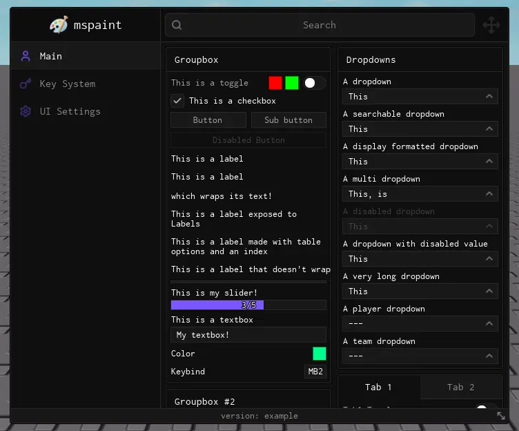

import { InlineTOC } from 'fumadocs-ui/components/inline-toc';
import { Tab, Tabs } from "fumadocs-ui/components/tabs";
import { TypeTable } from '@/components/type-table';
import { Accordion, Accordions } from 'fumadocs-ui/components/accordion';

<InlineTOC items={toc} />

---

## Window



The `Window` object is your base UI container. It hosts tabs, groupboxes and mostly everything else driven by the library. The next step to using the library is to [create a tab inside the window](../structure/tabs).

### Usage
Create a window with `Library:CreateWindow()` and override any defaults you need:

```lua
local Window = Library:CreateWindow({
    Title = "mspaint",
    Footer = "version: example",
    Icon = 95816097006870,
    NotifySide = "Right",
})
```

<TypeTable
  type={{
    Title: {
      description: 'The title displayed at the top of the window',
      type: 'string',
      default: '"No Title"',
      required: true
    },
    Footer: {
      description: 'The text displayed at the bottom of the window',
      type: 'string',
      default: '"No Footer"',
      required: true
    },
    Position: {
      description: 'The initial position of the window',
      type: 'UDim2',
      default: 'UDim2.fromOffset(6, 6)',
      required: false
    },
    Size: {
      description: 'The size of the window',
      type: 'UDim2',
      default: 'UDim2.fromOffset(720, 600)',
      required: false
    },
    Center: {
      description: 'Whether to center the window on the screen',
      type: 'boolean',
      default: 'true',
      required: false
    },
    AutoShow: {
      description: 'Whether to show the window immediately',
      type: 'boolean',
      default: 'true',
      required: false
    },
    ToggleKeybind: {
      description: 'The keybind to toggle the UI',
      type: 'Enum.KeyCode',
      default: 'Enum.KeyCode.RightControl',
      required: false
    },
    NotifySide: {
      description: 'The side to show notifications ("Left" or "Right")',
      type: 'string',
      default: '"Right"',
      required: false
    },
    ShowCustomCursor: {
      description: 'Whether to show a custom cursor',
      type: 'boolean',
      default: 'true',
      required: false
    },
    Font: {
      description: 'The font to use for text',
      type: 'Enum.Font',
      default: 'Enum.Font.Code',
      required: false
    },
    CornerRadius: {
      description: 'The corner radius for UI elements',
      type: 'number',
      default: '4',
      required: false
    },
    Icon: {
      description: 'Optional icon for the window',
      type: 'string/ID',
      default: 'nil',
      required: false
    },
    IconSize: {
      description: 'Size of the icon if provided',
      type: 'UDim2',
      default: 'UDim2.fromOffset(30, 30)',
      required: false
    },
    BackgroundImage: {
      description: 'Background image for the window',
      type: 'string/ID',
      default: 'nil',
      required: false
    },
    Resizable: {
      description: 'Whether the window can be resized',
      type: 'boolean',
      default: 'true',
      required: false
    },
    MobileButtonsSide: {
      description: 'Side to place mobile buttons on Load (Toggle/Lock buttons)',
      type: '"Left" | "Right"',
      default: '"Left"',
      required: false
    },
    DisableSearch: {
      description: 'Whether to disable the search box',
      type: 'boolean',
      default: 'false',
      required: false
    },
    SearchbarSize: {
      description: 'Size of the searchbar',
      type: 'UDim2',
      default: 'UDim2.fromScale(1, 1)',
      required: false
    },
    GlobalSearch: {
      description: 'Whether to enable a global search that searches in all the tabs.',
      type: 'boolean',
      default: 'false',
      required: false
    },
    UnlockMouseWhileOpen: {
      description: 'Whether to allow mouse movement while the Window is open even when the cursor\'s position is locked to the center (for example when in first person)',
      type: 'boolean',
      default: 'true',
      required: false
    },

    EnableSidebarResize: {
      description: 'Show a draggable handle so players can resize the sidebar',
      type: 'boolean',
      default: 'false',
      required: false
    },
    EnableCompacting: {
      description: 'Whether to allow compacting the sidebar',
      type: 'boolean',
      default: 'true',
      required: false
    },
    DisableCompactingSnap: {
      description: 'Whether to disable snapping while compacting the sidebar',
      type: 'boolean',
      default: 'false',
      required: false
    },
    SidebarCompacted: {
      description: 'Render the sidebar in compact mode (icons only) on first open',
      type: 'boolean',
      default: 'false',
      required: false
    },

    MinSidebarWidth: {
      description: 'Smallest width the sidebar can collapse to before switching into compact mode',
      type: 'number',
      default: '180',
      required: false
    },
    SidebarCompactWidth: {
      description: 'Width used while the sidebar is compacted',
      type: 'number',
      default: '48',
      required: false
    }
  }}
/>


#### ChangeTitle
Changes the title of the window.

```lua
Window:ChangeTitle("New Title")
```

| Arg Idx | Argument Description | Type | Default |
| --- | --- | --- | --- |
| 1 | The new title of the window | string | nil |

#### SetFooter
Changes the footer of the window.

```lua
Window:SetFooter("New Footer")
```

| Arg Idx | Argument Description | Type | Default |
| --- | --- | --- | --- |
| 1 | The new footer of the window | string | nil |

#### SetBackgroundImage
Changes the background image of the window. (Only works if `BackgroundImage` was set in the constructor)

```lua
Window:SetBackgroundImage("rbxasset://textures/ui/GuiImagePlaceholder.png")
```

| Arg Idx | Argument Description | Type | Default |
| --- | --- | --- | --- |
| 1 | The new background image of the window | string/ID | nil |

#### SetCornerRadius
Changes the corner radius for elements.

```lua
Window:SetCornerRadius(10)
```

| Arg Idx | Argument Description | Type | Default |
| --- | --- | --- | --- |
| 1 | The new corner radius | number | nil |

#### Toggle

Toggles the visibility of the window.

```lua
Window:Toggle()
```


### Sidebar Layout & Resizing

Obsidian can expose a draggable handle that lets players resize the sidebar at runtime. Enable it and tweak the behaviour directly from your window configuration:

```lua
local Window = Library:CreateWindow({
    Title = "mspaint",
    EnableSidebarResize = true,

    -- Optional Sidebar Settings
    MinSidebarWidth = 200, -- stop shrinking when the sidebar hits 200px
    SidebarCompactWidth = 56,
})
```

### Sidebar Methods

All window instances expose helpers for responding to layout changes or driving your own resizing logic.

#### GetSidebarWidth
Returns the current sidebar width in pixels.

```lua
local CurrentWidth = Window:GetSidebarWidth()
```

#### IsSidebarCompacted
Checks if the sidebar is currently in compact (icon-only) mode.

```lua
if Window:IsSidebarCompacted() then
    print("Sidebar is collapsed")
end
```

#### SetSidebarWidth
Programmatically resize the sidebar. Values outside the configured bounds are clamped automatically.

```lua
Window:SetSidebarWidth(240)
```

| Arg Idx | Argument Description | Type | Default |
| --- | --- | --- | --- |
| 1 | Desired sidebar width in pixels | number | `Width` |

#### SetCompact
Toggle compact mode explicitly. Pass `true` to force compact, or `false` to restore the last expanded width.

```lua
Window:SetCompact(true)
```

| Arg Idx | Argument Description | Type | Default |
| --- | --- | --- | --- |
| 1 | Whether the sidebar should stay compacted | boolean | — |

#### ApplyLayout
Re-apply all sidebar measurements.

```lua
Window:ApplyLayout()
```