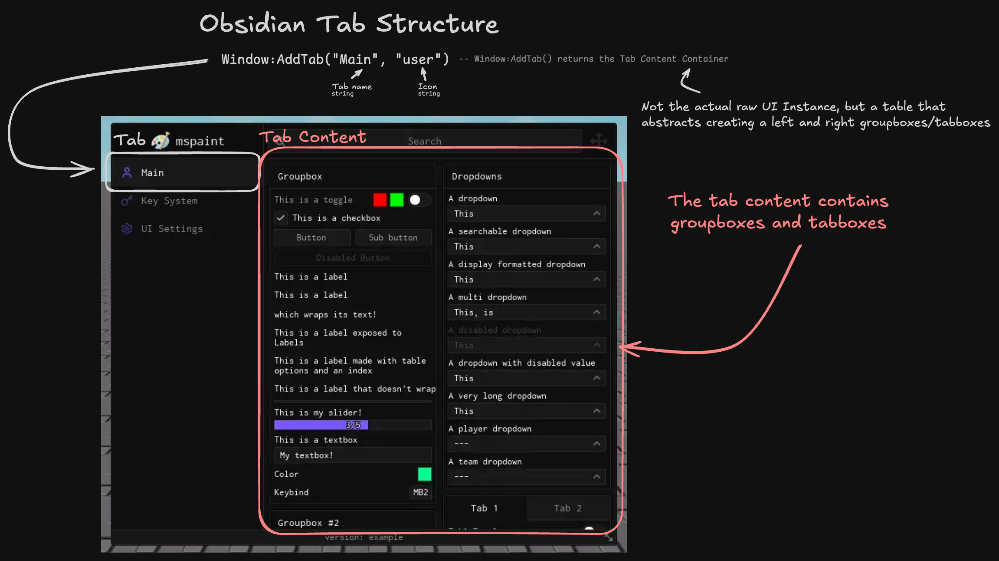
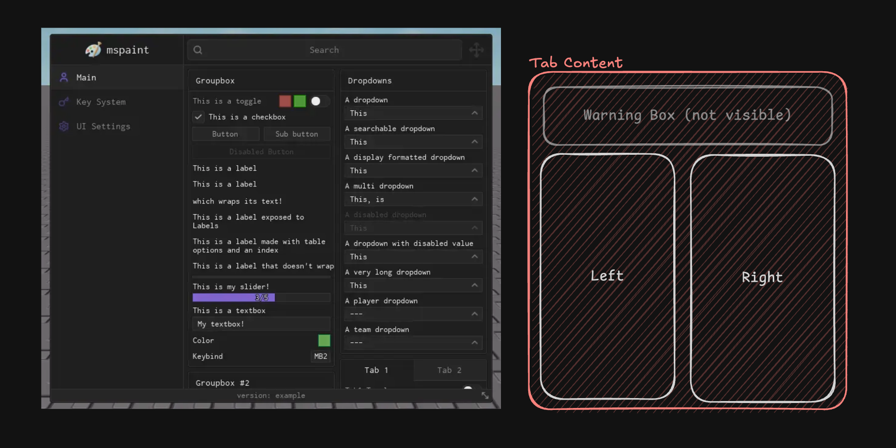
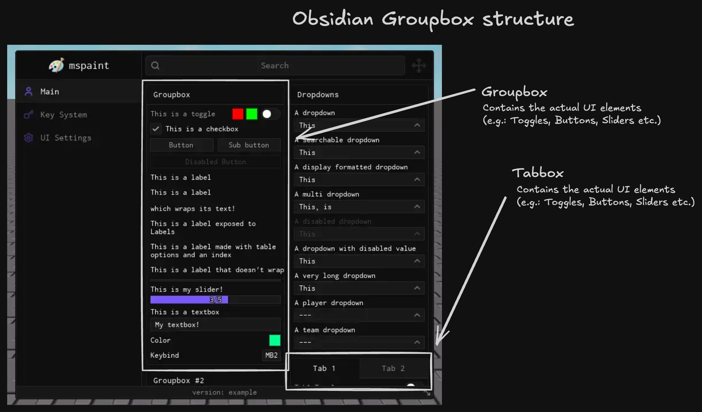

<Callout type="info">
    Obsidian uses a UI Library API similar to [LinoriaLib](https://github.com/mstudio45/linorialib). This means that our LinoriaLib fork and Obsidian are compatible with each other.
</Callout>

To structure your Obsidian UI, you first need to understand the underlying organization of Obsidian.

## Tabs

Tabs are the main way to seperate each category of elements for your UI.
Each tab has a name and optionally a description and icon. The tabs show up on the left side of the Obsidian window.

---

## Groupboxes & Tabboxes

Groupboxes and tabboxes are organized inside of the tab content area. The tab content area is divided into two columns, left and right. Each column can have multiple groupbox and/or tabbox inside of it.

Inside each groupbox/tabbox, you can add any UI Element in the UI elements section.

