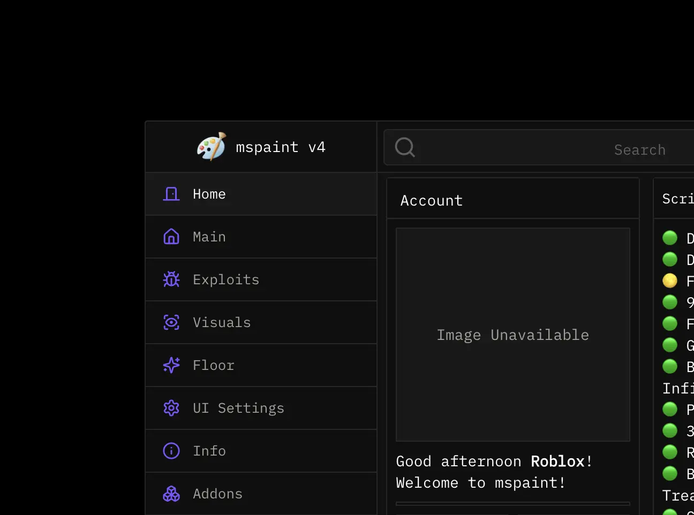
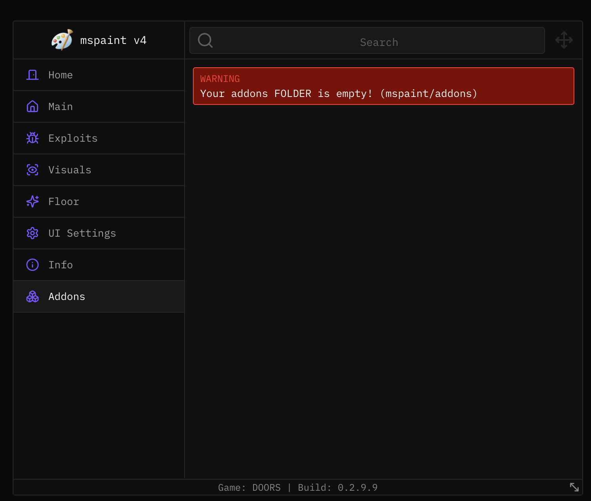
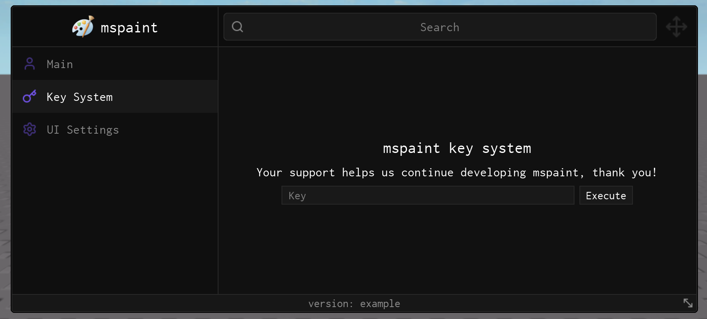

import { InlineTOC } from 'fumadocs-ui/components/inline-toc';
import { Tab, Tabs } from "fumadocs-ui/components/tabs";
import { TypeTable } from '@/components/type-table';

<InlineTOC items={toc} />

Tabs are the main way to sepearate each section for your UI. Each tab can have a name, icon and a description. The order is determined by the order of when `Window:AddTab()` is called.



## Quick Start

We recommend storing your tabs in a table to make it easier to manage.

```lua
local Tabs = {
    Main = Window:AddTab("Main", "user"),
    ["UI Settings"] = Window:AddTab("UI Settings", "settings"),
}
```

Once you have created your tabs, you can add UI elements to them via [groupboxes](./groupboxes) and/or [tabboxes](./tabboxes).

## Usage

You can create a Tab by calling the `AddTab` method on a Window.

### Arguments
```lua
local Tab = Window:AddTab("Main", "user")
```

| Arg Idx | Argument Description | Type | Default |
| --- | --- | --- | --- |
| 1 | Name of the tab | string | nil |
| 2 | Custom Icon or Icon name from lucide.dev | string | nil |
| 3 | Tab description | string | nil |

### Configuration Table
```lua
local Tab = Window:AddTab({
    Name = "Main",
    Description = "Main features",
    Icon = "home"
})
```

<TypeTable
  type={{
    Name: {
      description: 'The name of the tab',
      type: 'string',
      default: 'nil',
      required: true
    },
    Description: {
      description: 'The description of the tab',
      type: 'string',
      default: 'nil',
      required: false
    },
    Icon: {
      description: 'Custom Icon or Icon name from lucide.dev',
      type: 'string',
      default: 'nil',
      required: false
    }
  }}
/>

## Methods

You can use the following methods to interact with the tab:

#### UpdateWarningBox

Updates the warning box in a tab. This can be used to display warnings/errors, or any useful information.



```lua
Tab:UpdateWarningBox({
    Title = "Warning",
    Text = "Example",
    IsNormal = false, -- Error Box = true, Normal Box = false
    Visible = true,
    LockSize = true,
})
```

<TypeTable
    type={{
        Title: {
            description: 'The title of the warning box',
            type: 'string',
            default: 'nil',
            required: true
        },
        Text: {
            description: 'The text inside the warning box',
            type: 'string',
            default: 'nil',
            required: true
        },
        IsNormal: {
            description: 'Whether the warning box follows the normal Obsidian style or uses a red background',
            type: 'boolean',
            default: 'false',
            required: false
        },
        Visible: {
            description: 'Whether the warning box is visible',
            type: 'boolean',
            default: 'true',
            required: false
        },
        LockSize: {
            description: 'Whether the warning box should be locked to a fixed size',
            type: 'boolean',
            default: 'false',
            required: false
        }
    }}
/>

#### SetVisible
Shows or hides the tab.

```lua
Tab:SetVisible(boolean)
```

| Arg Idx | Argument Description | Type | Default |
| --- | --- | --- | --- |
| 1 | Whether to show the tab | boolean | nil |

#### SetOrder
Changes the order of the tab.

```lua
Tab:SetOrder(number)
```

| Arg Idx | Argument Description | Type | Default |
| --- | --- | --- | --- |
| 1 | New order of the tab | number | nil |

#### SetName
Updates the name of the tab.

```lua
Tab:SetName(name)
```

| Arg Idx | Argument Description | Type | Default |
| --- | --- | --- | --- |
| 1 | New name of the tab | string | nil |

#### SetDescription
Updates the description of the tab.

```lua
Tab:SetDescription(description)
```

| Arg Idx | Argument Description | Type | Default |
| --- | --- | --- | --- |
| 1 | New description of the tab | string | nil |

#### SetIcon
Updates the icon of the tab.

```lua
Tab:SetIcon(icon)
```

| Arg Idx | Argument Description | Type | Default |
| --- | --- | --- | --- |
| 1 | New icon of the tab | string | nil |

## Example

```lua
local Tabs = {
    Main = Window:AddTab("Main", "user"),
    ["UI Settings"] = Window:AddTab("UI Settings", "settings"),
}
```

---

# Key Tabs

Key tabs are used to display items at the center and it's intended use as a menu to display a key system page.



### Usage

You can create a Key Tab by calling the `AddKeyTab` method on a Window.

### Arguments
```lua
local KeyTab = Window:AddKeyTab("Key System", "key")
```

<Callout type="info">
    Key Tabs take the same arguments as regular tabs
</Callout>

## Methods

Key tabs inherit all methods from the [groupboxes](./groupboxes) and [tabboxes](./tabboxes) which means you can add any UI element to it as well.

### AddKeyBox
Adds a key box to the key tab.

```lua
-- Dynamic Check
KeyTab:AddKeyBox(function(Success, ReceivedKey)
	print("Expected Key: None | Success:", Success) -- true
	Library:Notify("Success: " .. tostring(Success), 4)
end)

-- Static Check
KeyTab:AddKeyBox("Banana", function(Success, ReceivedKey)
	print("Expected Key: Banana | Success:", Success) -- true
	Library:Notify("Success: " .. tostring(Success), 4)
end)
```

## Example


```lua
local KeyTab = Window:AddKeyTab("Key System", "key")

KeyTab:AddLabel({
	Text = "mspaint key system",
	DoesWrap = true,
	Size = 20,
})

KeyTab:AddLabel({
	Text = "Your support helps us continue developing mspaint, thank you!",
	DoesWrap = true,
	Size = 16,
})

KeyTab:AddKeyBox(function(Success, ReceivedKey)
	print("Expected Key: None | Success:", Success)
	Library:Notify("Success: " .. tostring(Success), 4)
end)
```
